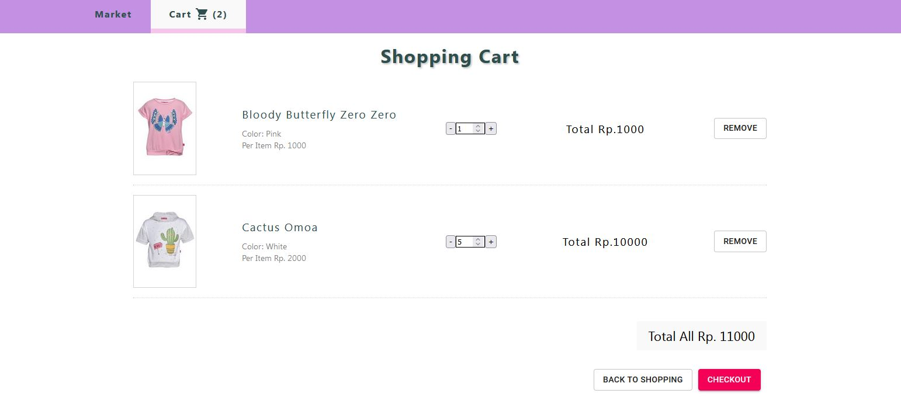

# shopping-cart-my-ver

> _This repo was created for learning purposes and one of the [_**#Coming Back To Programming**_](https://github.com/xvferdy/beginner-portfolio "Beginner Portfolio") activities that started on September 24 2021…_

## :round_pushpin:Table of Contents
- [About The Project](#about-the-project)
    - [Built with](#built-with)
- [Getting Started](#getting-started)
    - [Prerequisites](#prerequisites)
    - [Installation](#installation)
    - [Launch](#launch)

## About the Project
Simple implementation of state management using react built-in hooks ➤ `useContext()`, `useReducer()` and as an example of a case study on this project is a supermarket/shopping cart.

**[Demo](https://xvferdy.github.io/shopping-cart-my-ver/)** 👓 
<p align="">
  
</p>

### Built With
- React
- [Material-UI](https://github.com/mui-org/material-ui)

## Getting Started
### Prerequisites
- [Node.js](https://nodejs.org/en/)
- [NPM](https://www.npmjs.com/)


### Installation
```
npm install
```
```
npm start
```
**Deployment**
```
npm install --save gh-pages
```
###### package.json
```JSON
  "homepage": "https://myusername.github.io/shopping-cart-my-ver",
  "scripts": {
    "predeploy": "npm run build",
    "deploy": "gh-pages -d build",
  },
```
```
npm run deploy
```

## Launch
- http://localhost:3000/ ➡️ Product list
- http://localhost:3000/shopping-cart ➡️ Cart list


<h3 align="right">
      <a href="#shopping-cart-my-ver">To Top ⤴️</a>
</h3>
